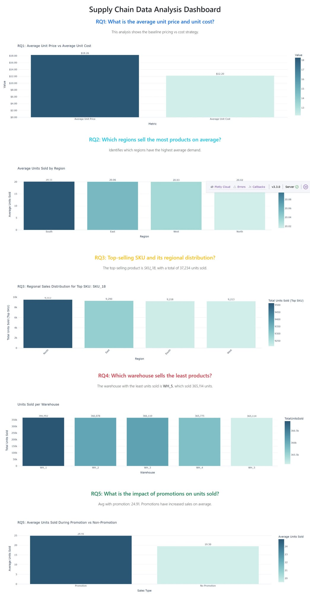

# Supply Chain Dash Dashboard (Intro to Python – Group Project)



Interactive analytics dashboard built with **Dash + Plotly** to answer five research questions (RQ1–RQ5) on a supply chain dataset.  
This repository showcases an end-to-end workflow: **data standardization → modular analyses → a single working dashboard app**.

## What the app does
- Cleans/standardizes raw data (column names, types, missing values)
- Runs analysis modules (RQ1–RQ5) and generates Plotly visuals
- Presents results in one Dash dashboard with consistent layout and filtering behavior

## Contributions Summary
- Implemented **RQ1** analysis and visualization
- Took ownership of **integration and debugging**:
  - merged teammates’ modules into one working application
  - resolved mismatches across scripts (function inputs/outputs, imports, naming)
  - aligned data-model assumptions so all plots render correctly
  - updated the main app + data modelling logic to ensure the dashboard runs end-to-end

## Team / attribution
This was a **group project**. RQ2–RQ5 scripts were authored by teammates and are included with attribution.
I do not claim individual authorship of teammates’ analysis modules.

## Data note
The original dataset is not included due to usage restrictions.

## How to run
```bash
pip install -r requirements.txt
python app.py
